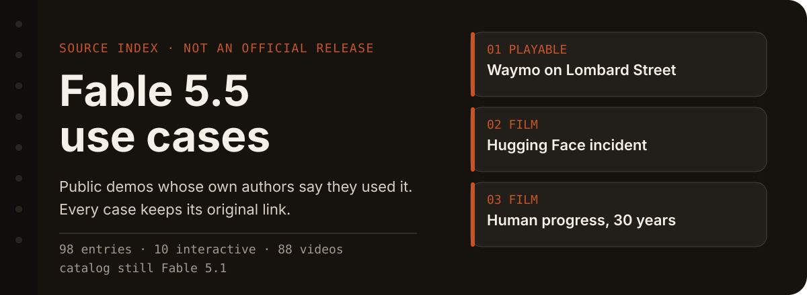
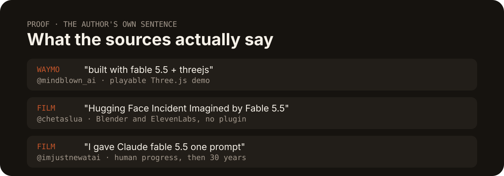
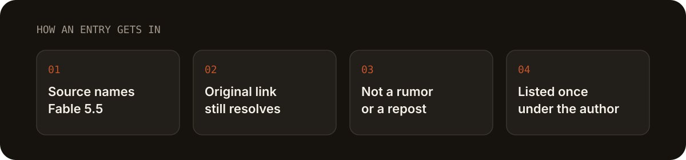

  

A curated list of **public use cases attributed to Claude Fable 5.5**, collected from GitHub, X, and Hacker News.

*Claude Fable 5.5 公开用例精选。只收录带来源链接的社区案例。*

**Status.** As of 2026-10-03, Anthropic's public model catalog still lists Claude Fable 5.1. This list does not claim an official Fable 5.5 release, and it does not copy rumored specs, prices, or benchmarks. An entry is included only when a public source says Fable 5.5 was used and the link still resolves.

33 entries (3 playable demos, 30 videos). Last updated 2026-10-03.

  

## Featured

- [Waymo teleoperator](https://x.com/mindblown_ai/status/2106112279079199037) — @mindblown_ai — Playable Three.js Waymo run, including Lombard Street. **[Play](https://teleoperator.mindblown.ai)**. The post says "built with fable 5.5 + threejs".
- [Hugging Face incident](https://x.com/chetaslua/status/2105884276864782557) — @chetaslua — A Blender and ElevenLabs short the author says was "Imagined by Fable 5.5", all code, no skill or plugin.
- [Human progress, then 30 years](https://x.com/imjustnewatai/status/2106081142143168580) — @imjustnewatai — "I gave Claude fable 5.5 one prompt: a video of all human progress, then 30 years into the future."

## What this is

A source index, not a model card. The cases below are community posts. Each one is here because the author wrote Fable 5.5 in the post itself.

  

A post that only predicts a release, leaks a system prompt, or repeats someone else's video stays out. Nothing on this page is an official score, price, or spec.

  

## Interactive 3D and games

- [Waymo teleoperator on Lombard Street](https://x.com/mindblown_ai/status/2106112279079199037) — @mindblown_ai — A playable Three.js Waymo teleoperator on a San Francisco map. The post shows a Lombard Street run and says it was built with Fable 5.5. **[Live demo](https://teleoperator.mindblown.ai)**
- [Lower Manhattan buildings by year](https://x.com/nroze22/status/2106183281293381661) — @nroze22 — An interactive architectural drawing of every building standing in Lower Manhattan today, drawn in the year it went up. The author says they asked Fable 5.5 for it. **[Live demo](https://claude.ai/artifact/Tx5L1sQeXd4e7vp9DifrwK)**
- [Three-body problem in Bend2](https://x.com/zAdrielsan/status/2105822678519001360) — @zAdrielsan — A one-shot Bend2 three-body simulation the author says Fable 5.5 returned, with symplectic physics and formally proven laws. **[GitHub](https://github.com/AdrielSantana/three-bodies)**

## Videos from X

Video works whose authors attribute them to Claude Fable 5.5. Each item links the creator's original X post (`@author`). Every post was checked on 2026-10-03 to exist, to say Fable 5.5 in its own text, and to carry a native video, using both `api.fxtwitter.com` and `cdn.syndication.twimg.com`. Reposts of the same video are listed once, under the original creator. These posts are community claims. They are not an official model card. 30 entries.

### Motion design and code-drawn animation

- [15-minute animation from one line](https://x.com/cherry_mx_reds/status/2105816670896009224) — @cherry_mx_reds — A short animation the author says Fable 5.5 made about 15 minutes after "Hey Fable, please make a cool animation." The post says "FABLE 5.5 IS SO GOOD AT THESE."
- [Pixar side quest from a dot](https://x.com/cherry_mx_reds/status/2105825930799432073) — @cherry_mx_reds — "I asked for a dot. Fable 5.5 gave me a Pixar side quest."
- [Superman across art styles](https://x.com/chetaslua/status/2105757136219504862) — @chetaslua — "Welcome To the era of Super intelligence : Fable 5.5" and "behold superman in continuous animation in different art style."
- [Marvel and DC heroes in pure JS](https://x.com/chetaslua/status/2105792187200147541) — @chetaslua — "Fable 5.5 Pure Js one Shot Marvel and DC heroes." The author says Fable chose the character details and edited the video.
- [Fast motion-design video](https://x.com/blueemi99/status/2106031355922387163) — @blueemi99 — "Fable 5.5 - made me a short, fast motion video, proving how good of a motion designer is it."
- [Halloween piece told not to show off](https://x.com/cherry_mx_reds/status/2106056643255447590) — @cherry_mx_reds — "I asked Fable 5.5 to make me something for Halloween."
- [Viral memes, 2010 to 2026](https://x.com/chetaslua/status/2106076940558082297) — @chetaslua — "Big brother Fable 5.5 shows up" in "every viral meme 2010 → 2026, each year in its own art style + its own music," in pure code.
- [40,000 years of art history](https://x.com/cherry_mx_reds/status/2106095190285144331) — @cherry_mx_reds — 15 seconds of art history with a cat subplot. The post says "FABLE 5.5 MUST BE PACED IMMEDIATELY."
- [Spider-Man across ten comic eras](https://x.com/chetaslua/status/2106248621519978867) — @chetaslua — "Spiderman in 10 era of comics : Fable 5.5."
- [Day in the Life of Claude](https://x.com/ishuagra02/status/2106045364868419727) — @ishuagra02 — "Animated by Fable 5.5." A day-in-the-life short for the Claude mascot.
- [clawdhouse intro video](https://x.com/ishuagra02/status/2106138602073641241) — @ishuagra02 — Promo for a Claude Code mod; "btw this video was created with Fable 5.5."
- [Claude hits the beat](https://x.com/ishuagra02/status/2106369929813594134) — @ishuagra02 — "Animated by Fable 5.5."
- [Queens of the Stone Age kinetic lyric video](https://x.com/atomtanstudio/status/2106135196483608745) — @atomtanstudio — "I had it make this kinetic typography music mideo on max reasoning" for Songs for the Deaf.
- [Propellerheads lyric video](https://x.com/atomtanstudio/status/2106353569603736009) — @atomtanstudio — "Another Fable 5.5 masterpiece." Propellerheads — On Her Majesty's Secret Service.
- [Chemical Brothers Go lyric video](https://x.com/atomtanstudio/status/2106377491267137848) — @atomtanstudio — "using Fable 5.5 on Max reasoning."
- [One-line prompt motion clip](https://x.com/devswha/status/2106072107365114186) — @devswha — "okay one line prompt with fable 5.5."
- [One-prompt motion video](https://x.com/devswha/status/2106100273509007802) — @devswha — "Did I just make this motion video with Fable 5.5?" No assets, no reference video.
- [Kung-Fu Boy](https://x.com/HashmathRzz/status/2106065773336965510) — @HashmathRzz — "Made with Fable 5.5."
- [Fable 5.5 introduction video](https://x.com/devteamdrew/status/2106155815707021549) — @devteamdrew — "I asked Fable 5.5 to create its own introduction video."

### Interactive 3D

- [Voxel build of yourself](https://x.com/blueemi99/status/2105804692811137242) — @blueemi99 — "New Fable 5.5 (maybe) - A voxel build of yourself." The author hedges, and says the scene looks better than Fable 5.1 and Opus 5.5.
- [Zero-shot voxel world and a DMC game](https://x.com/OnlyTerp/status/2106089280502210626) — @OnlyTerp — "Fable 5.5 is out of this world!" A zero-shot voxel world the author says beat Fable 5.1, plus a Devil May Cry-style game they asked Fable 5.5 to make.
- [Fable 5.5 vs Fable 5.1 comparison clip](https://x.com/marcthecreatorr/status/2106369223312240928) — @marcthecreatorr — "Fable 5.5 vs Fable 5.1 (Forerunner vs Successor)"; the author says the 5.5 result took about 10 minutes from a single prompt.

### Films

- [Hugging Face incident, Blender and ElevenLabs](https://x.com/chetaslua/status/2105884276864782557) — @chetaslua — "Hugging Face Incident Imagined by Fable 5.5," "all code with blender and elevenlab api," no skill or plugin.
- [Song lyrics tied to the Hugging Face incident](https://x.com/chetaslua/status/2105934928483701214) — @chetaslua — "Fable 5.5 : asked it to connect the lyrics of this song with the hugginface incident."
- [Civilization from day one, all code](https://x.com/ziwenxu_/status/2105983571848741045) — @ziwenxu_ — "I gave Claude Fable 5.5 one challenge": "Show civilization from day one to now. Go all out." No footage, no stock.
- [The Universe Looks at Itself](https://x.com/l_mejiaC/status/2105988529671360673) — @l_mejiaC — "Fable 5.5" / "The Universe Looks at Itself." 13.8 billion years in one shot, frames and music computed in code.
- [Human progress, then 30 years on](https://x.com/imjustnewatai/status/2106081142143168580) — @imjustnewatai — "I gave Claude fable 5.5 one prompt: a video of all human progress, then 30 years into the future."
- [Quarks to the observable universe](https://x.com/imjustnewatai/status/2106190594775097663) — @imjustnewatai — "I told Claude fable 5.5 to pick its own video idea": a zoom from three quarks across 42 powers of ten, visuals and music in code.
- [Scary illuminati video](https://x.com/badboyfoxy/status/2106241189976387799) — @badboyfoxy — "i asked fable 5.5 to make a scary video about the illuminati."
- [Humanity walks across 30,000 years of art](https://x.com/l_mejiaC/status/2105801379956850793) — @l_mejiaC — "Made with fable 5.5." One person crosses 30,000 years of art in 74 seconds; every frame and the music drawn in code.

Routing rumors, release predictions, and roundups that do not themselves present an artifact are left out. No benchmark pages. Nothing here is an official Fable 5.5 score, price, or spec.

## Contributing

See [CONTRIBUTING.md](CONTRIBUTING.md).

## License

  
  

[CC0 1.0](LICENSE).
